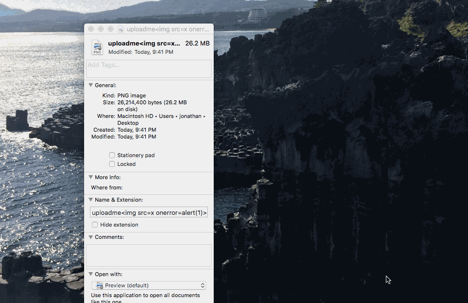
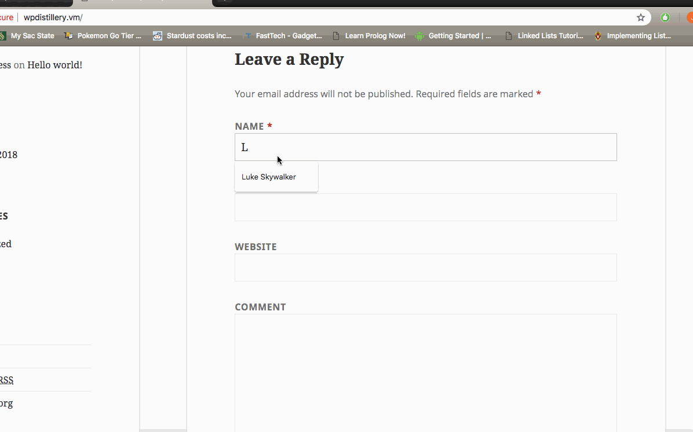

# Project 7 - WordPress Pentesting

Time spent: Approximately 4 hours.

> Objective: Find, analyze, recreate, and document **five vulnerabilities** affecting an old version of WordPress

## Pentesting Report

1. Large File Upload Error XSS
  - [X] Summary: 
    - Vulnerability types: XSS
    - Tested in version: 4.2
    - Fixed in version: 4.2.15
  - [X] GIF Walkthrough:  
  - [X] Steps to recreate: 
     -We need to create a file that is 20 MB or larger. The file name should have the payload script embedded in it.      Example file ~26MB: uploadme.png  
     -The next goal would be to trick an admin of the site to upload the file into the site.  
     -Since the file is larger than 20MB, WordPress reads the file name and executes the script that is embedded.  
     -Report found in WPScan: https://hackerone.com/reports/203515  
  - [X] Affected source code:
    [Link 1] (https://core.trac.wordpress.org/browser/trunk/src/wp-includes/script-loader.php)

2. Unauthenticated Stored Cross-Site Scripting  
  - [X] Summary: 
    - Vulnerability types: XSS
    - Tested in version: 4.2
    - Fixed in version: 4.2.1
  - [X] GIF Walkthrough:   
  - [X] Steps to recreate:    
        -Post a comment wtih HTML tags and some type of script. It is important to note that the comment must be                     larger than 64KB.  
       -Example snippit:  
        HTML
        
      
  - [ ] Affected source code:
    I could not find affected source code, but there is amplifying information found at:  
    [Link 1] (https://packetstormsecurity.com/files/131644/)
    
1. WordPress User Enumeration
  - [ ] Summary: 
    - Vulnerability types: User Enumeration
    - Tested in version: 4.2
    - Fixed in version: Unsure.I could not get it to work in version 4.9.
  - [ ] GIF Walkthrough: 
  - [ ] Steps to recreate:  This one is as simple as running a bash script and pasting the target WordPress site into it.  The script is: for i in {1..10}; do curl -s -L -i http://wpdistillery.vm?author=$i | grep -E -o "\" title=\"View all posts by [a-z0-9A-Z\-\.]*|Location:.*" | sed 's/\// /g' | cut -f 6 -d ' ' | grep -v "^$"; done
  
  - [ ] Affected source code:  
    - Unsure, but there is amplifying information about this attack at: https://hackertarget.com/wordpress-user-enumeration
1. (Optional) Vulnerability Name or ID
  - [ ] Summary: 
    - Vulnerability types:
    - Tested in version:
    - Fixed in version: 
  - [ ] GIF Walkthrough: 
  - [ ] Steps to recreate: 
  - [ ] Affected source code:
    - [Link 1](https://core.trac.wordpress.org/browser/tags/version/src/source_file.php)
1. (Optional) Vulnerability Name or ID
  - [ ] Summary: 
    - Vulnerability types:
    - Tested in version:
    - Fixed in version: 
  - [ ] GIF Walkthrough: 
  - [ ] Steps to recreate: 
  - [ ] Affected source code:
    - [Link 1](https://core.trac.wordpress.org/browser/tags/version/src/source_file.php) 

## Assets

20MB+ file with embedded script for attack #1.

## Resources

- [WordPress Source Browser](https://core.trac.wordpress.org/browser/)
- [WordPress Developer Reference](https://developer.wordpress.org/reference/)

GIFs created with [LiceCap](http://www.cockos.com/licecap/).

## Notes

Describe any challenges encountered while doing the work

## License

    Copyright 2018 Jonathan Neronde

    Licensed under the Apache License, Version 2.0 (the "License");
    you may not use this file except in compliance with the License.
    You may obtain a copy of the License at

        http://www.apache.org/licenses/LICENSE-2.0

    Unless required by applicable law or agreed to in writing, software
    distributed under the License is distributed on an "AS IS" BASIS,
    WITHOUT WARRANTIES OR CONDITIONS OF ANY KIND, either express or implied.
    See the License for the specific language governing permissions and
    limitations under the License.
